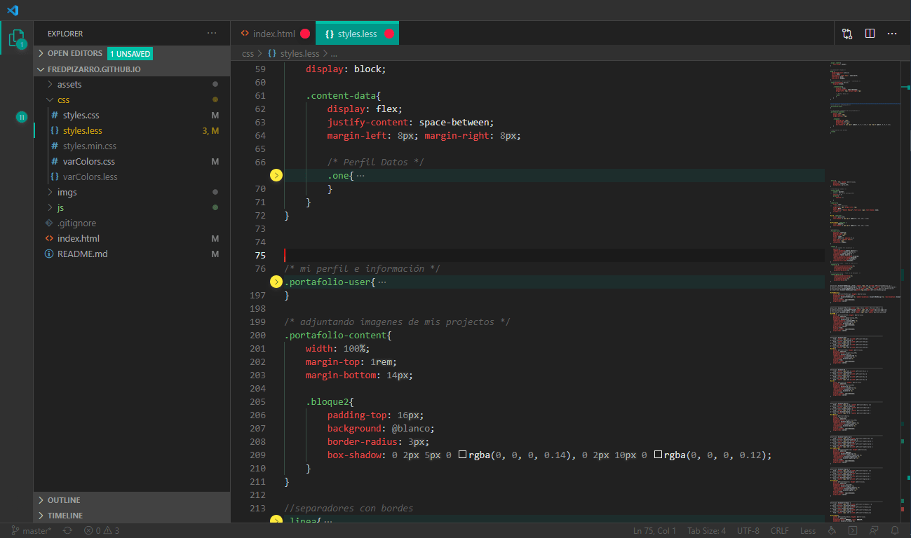
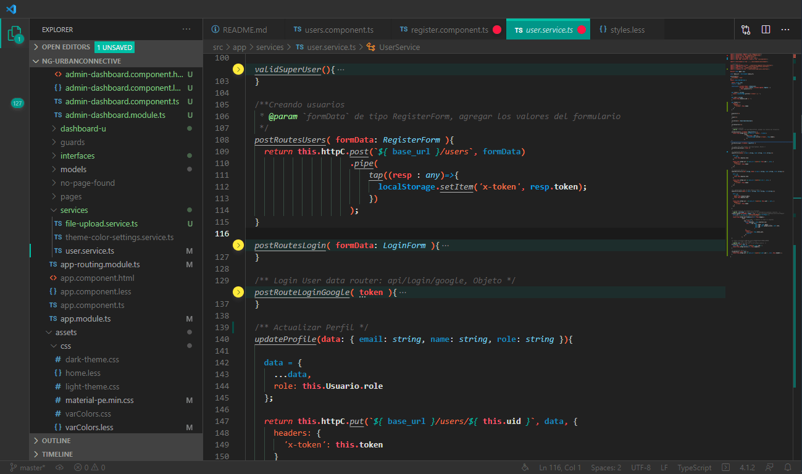

# Coffee Color Dark Syntax

=======
## This is the README for your extension "Coffe Color dark syntax"
* Suggestions are accepted for design theme Material Color (Dark) in Contact more info ...
* Version Mode dark: Material Color (dark) in  https://github.com/FredPizarro/coffee-color-dark-syntax/
* Versions and Comment/bugs in https://github.com/FredPizarro/coffee-color-dark-syntax/issues
 
 Color Syntax
## Manual mode
Clone a copy of the repo:

```
git clone https://github.com/FredPizarro/theme-light-coffee-color.git
```

in you location `.vscode/extensions/` under your user directory.

Depending on your platform, this folder is located here:
* **Windows** `%USERPROFILE%/`
* **Mac** `$HOME/Library/Application Support/`
* **Linux** `$HOME/.config/`

As this location is under your user directory, the content is persisted across Code updates.

=======
# Images

#### view in html

#### view in CSS

#### view in javascript



# Coffee Color (Dark Theme)
* add Installation

# Installation 
• install this theme
• install `Custom CSS and JS Loader`
• link the CSS file from this extension in your vscode settings.json:

On Mac it might look something like the snippet below:

```
{
  "vscode_custom_css.imports": [
    "file:///Users/Skyrider/.vscode/extensions/coffee-color-dark-syntax/themes/base.css"
    ]
}
```

Windows might resemble:

```
{
  "vscode_custom_css.imports": [
    "file:///C:/Users/Skyrider/.vscode/extensions/coffee-color-dark-syntax/base.css"
    ]
}
```

=======
# Contact
More contributions and suggestions in the theme to:

* E-mail:  Freddy_ps_3@hotmail.com
* Twitter: https://twitter.com/Fred_Pizarro

Copyright © 2015-2017 [MIT License](https://github.com/FredPizarro/theme-light-coffee-color/blob/master/LICENSE/) by Fred Pizarro. 

**Enjoy!**
